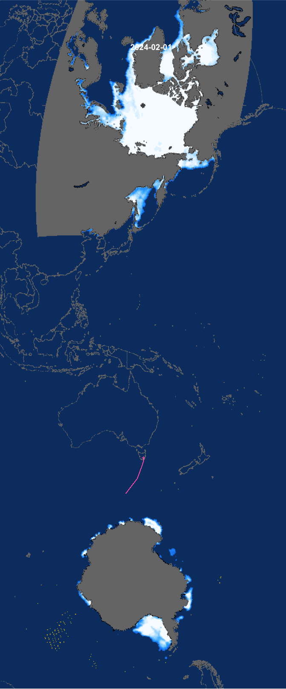

<!-- README.md is generated from README.Rmd. Please edit that file -->

# seaice.map

<!-- badges: start -->

[](https://github.com/mdsumner/seaice.map/actions/workflows/R-CMD-check.yaml)
<!-- badges: end -->

The goal of seaice.map is to … display this image.

``` r
library(terra)
#> terra 1.7.41
plot(rast("data-raw/seaice.png"), axes = F)
```



## Code of Conduct

Please note that the seaice.map project is released with a [Contributor
Code of
Conduct](https://contributor-covenant.org/version/2/1/CODE_OF_CONDUCT.html).
By contributing to this project, you agree to abide by its terms.
